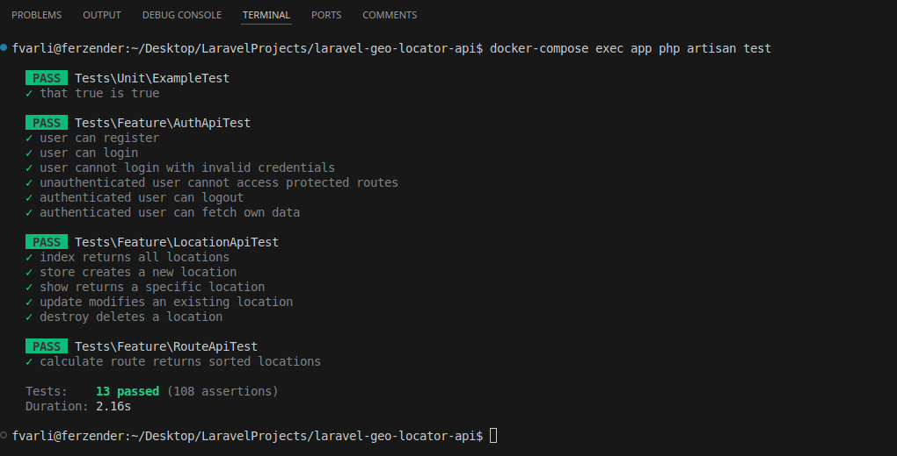
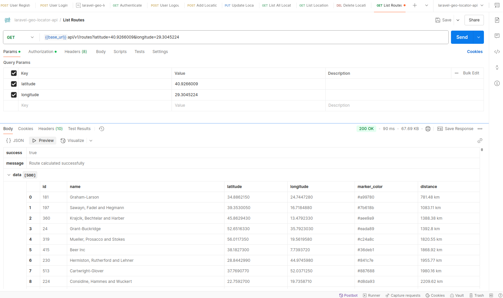

# 📍 Laravel Geo Locator API Guide

A robust and scalable location management API built with **Laravel 10**, **MySQL**, and **Docker**. This project allows users to manage locations, visualize them on a map with custom markers, and calculate optimal routes based on straight-line distances. The API is fully containerized with Docker, making it easy to deploy and scale.

---

## Features

- **Versioning**:
  - The API follows versioning conventions (/v1/) for backward compatibility and future updates.

- **Location Management**:
  - Add new locations with name, latitude, longitude, and custom marker color.
  - Edit existing locations.
  - Delete locations.
  - List all saved locations with their details.
  - View details of a specific location.

- **Route Calculation**:
  - Calculate the optimal route from a given starting point to all saved locations, sorted by distance (straight-line, bird's-eye view).

- **Authentication**:
  - User registration and login with token-based authentication.
  - Protected endpoints for authenticated users only.

- **Rate Limiting**:
  - API rate limiting to prevent abuse.

- **Validation**:
  - Robust validation for all incoming requests.

- **Dockerized**:
  - Fully containerized with Docker and Docker Compose for easy setup and deployment.

- **Postman Collections & Environments**:
  - Predefined Postman collection and environment files are available in resources/docs/postman/ for quick API testing.

---

## Technologies Used

- **Backend**: Laravel 10 (PHP 8.2)
- **Database**: MySQL 8.0
- **Containerization**: Docker & Docker Compose
- **Web Server**: Nginx
- **ORM**: Eloquent ORM
- **API Design**: RESTful API with versioning (/v1/)
- **Authentication**: Laravel Sanctum (Token-based)
- **Testing**: Feature Tests
- **Validation**: Laravel Request Validation
- **Rate Limiting**: Laravel Throttle Middleware

---

## Project Architecture
- **API Response Structure**: Standardized responses using `APIResponse.php` for success & error handling.
- **Service Layer**: Business logic is handled in `App\Services` (e.g., `LocationService.php`).
- **Exception Handling**: Centralized exception handling in `App\Exceptions\Handler.php`.
- **Middleware**: Custom middleware for security, authentication, and rate limiting.

---

## Project Structure

The project follows a layered architecture with clear separation of concerns:

- **Controllers**: Handle HTTP requests and responses.
- **Services**: Contain business logic.
- **Models**: Represent database entities.
- **Requests**: Handle validation for incoming requests.
- **Resources**: Transform models into JSON responses.
- **Middleware**: Handle cross-cutting concerns like authentication and rate limiting.
- **Tests**: Contains all API tests.
- **Documentation**:
  - Postman collection: resources/docs/postman/laravel-geo-locator-api.postman_collection.json
  - Postman environment: resources/docs/postman/laravel-geo-locator-api.postman_environment.json

---

## API Endpoints

### Authentication
- **POST /api/v1/register**: Register a new user.
- **POST /api/v1/login**: Login and get an access token.
- **POST /api/v1/logout**: Logout and revoke the access token.
- **GET /api/v1/user**: Get authenticated user details.

### Locations
- **GET /api/v1/locations**: List all locations.
- **POST /api/v1/locations**: Add a new location.
- **GET /api/v1/locations/{id}**: Get details of a specific location.
- **PUT /api/v1/locations/{id}**: Update a location.
- **DELETE /api/v1/locations/{id}**: Delete a location.

### Routes
- **GET /api/v1/routes**: Calculate the optimal route from a given starting point (latitude, longitude) to all saved locations.

---

## Setup & Installation

### Prerequisites

- Docker and Docker Compose installed on your machine.
- Git for cloning the repository.

### Step 1: Clone the Repository

```bash
git clone https://github.com/fvarli/geo-locator-api.git
cd geo-locator-api
```

### Step 2: Configure Environment Variables

Copy the `.env.example` file to `.env` and update the database credentials:

```bash
cp .env.example .env
```

Edit the `.env` file:

```bash
DB_CONNECTION=mysql
DB_HOST=db
DB_PORT=3306
DB_DATABASE=laravel
DB_USERNAME=root
DB_PASSWORD=secret
DB_ROOT_PASSWORD=secret
```

### Step 3: Build and Run Docker Containers

Run the following command to build and start the Docker containers:

```bash
docker-compose up -d --build
```

This will start the following services:
- **app**: Laravel application (PHP 8.2)
- **db**: MySQL database
- **webserver**: Nginx web server

### Step 4: Run Migrations

After the containers are up, run the database migrations:

```bash
docker-compose exec app php artisan migrate
```

### Step 5: Access the API

The API will be available at `http://localhost:8000/api/v1`.

---

## Running Tests

To run the Feature Tests, execute the following command:

```bash
docker-compose exec app php artisan test
```





## Contact

- Website: [www.ferzendervarli.com](https://www.ferzendervarli.com/)
- GitHub: [github.com/fvarli](https://github.com/fvarli)
- LinkedIn: [linkedin.com/in/fvarli](https://www.linkedin.com/in/fvarli)